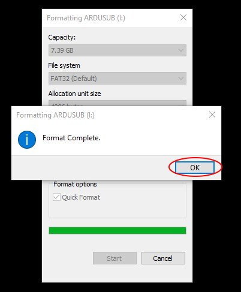
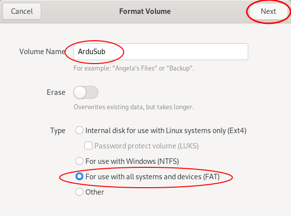
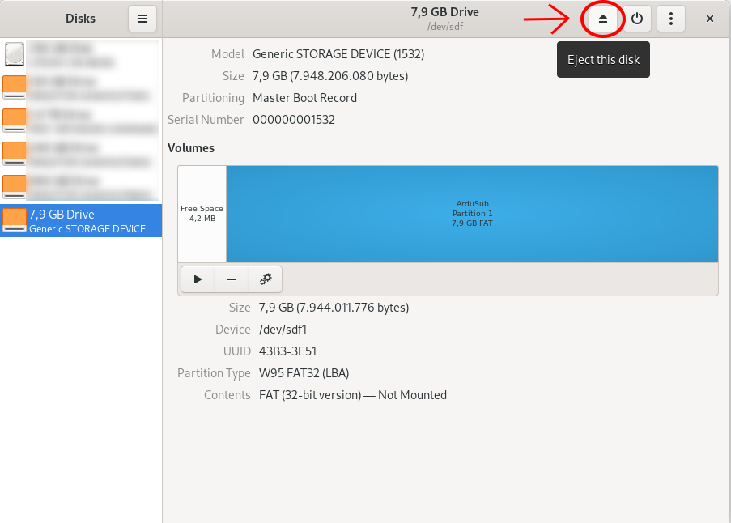



# Installing ArduSub

>**Note** The current Stable version of ArduSub is **v4.0.3**. If your firmware is out of date, it may be updated by following one of the methods below.

ArduSub is the firmware binary which resides on the flash memory of the autopilot board. 

It may be installed (or updated) in one of two ways:
1. Connecting it to a Companion Computer and pressing the appropriate button.
2. Directly connecting the board to a Topside Computer with QGroundControl via a USB cable.

## With a Companion Computer (Automatic Installation)

To load ArduSub onto an autopilot board:

1. Plug a *fully charged* battery into the vehicle and connect the tether to the topside computer.

2. Navigate to [192.168.2.2:2770/network](http://192.168.2.2:2770/network) in an internet browser (Chrome, Edge, Firefox, etc.) and ensure that the vehicle has access to a WiFi network. If you do not see a webpage at this address, verify the network settings are correct. Troubleshooting steps can be found [here](/reference/troubleshooting.md).

3. Navigate to [192.168.2.2:2770/system](http://192.168.2.2:2770/system). Click the button under the *Pixhawk Firmware Update* section that says **Stable**.

4. Wait for the update process to complete, and you are finished!

## Without a Companion Computer (Manual Installation)

1. Open QGroundControl and navigate **[Firmware](/reference/ardusub/firmware-page.md)** page.
2. Plug in the Pixhawk to the computer's USB port. Once detected, QGroundControl will show a firmware selection box on the right. 
3. Choose **"ArduPilot Flight Stack"**, then select **"ChibiOS"**, **"Sub"**, and (assuming you are using a Pixhawk) **"Pixhawk1"** from the dropdown list.

4. Press "OK" at the top right. 
5. The firmware will upload the Pixhawk and you'll see the following printout and success message. The Pixhawk will reboot and then will automatically connect with QGroundControl.

# Frame Selection

1. Go the **[Frame Setup](/reference/ardusub/frame-setup-page.md)** page.
2. Click on the corresponding vehicle frame that was originally picked out in the "[Building a Vehicle Frame](/quick-start/vehicle-frame.md)" section of this documentation.
3. Reboot the vehicle or autopilot for the frame selection to be saved and loaded on the next start.

> **Note** Default parameters only exist for the BlueROV2 and BlueROV2 Heavy. If using another frame type, parameter settings will need to be manually configured in the following steps. 

# Completing Calibrations

Before an ArduSub vehicle may be used, several calibration and setup steps must be completed for it to function correctly.

## Joystick/Gamepad Calibration

Some joysticks require calibration before they can be enabled for use with QGroundControl. If a joystick requires calibration, the **[Joystick](https://github.com/bluerobotics/ardusub-gitbook/blob/ArduSub-Docs-Overhaul/reference/ardusub/joystick-setup-page.md)** tab will be red, and these steps should be followed to calibrate the joystick. If the joystick does not require calibration, the **Joystick** tab will not be red, and this step can be skipped!

1. Go to the **Joystick** page in the sidebar on the left.
2. Ensure the 'TX Mode' selection is set to 3.
3. Click on the "Calibration" tab, then click "Next".
4. Follow the step-by-step instructions, move the sticks as indicated in the diagram in QGroundControl.

When completed, the **Joystick** tab will no longer be red, and the *Enabled* checkbox on the Joystick page should be checked.

## Button Setup

The default button setup for ArduSub is as shown in the image below:

The button functions may be reconfigured in the **Joystick** page.

## Sensor Calibration

1. Go to the **[Sensors](/reference/ardusub/sensors-setup-page.md)** tab in the sidebar on the left.
2. Click on the **Accelerometers** tab and follow the instructions.
* Choose **Roll90** for the **Autopilot Orientation** selection.
3. Click on **Compass** and follow the instructions.
4. Click on **Calibrate Pressure** and wait for the calibration to complete.

When completed, the **Sensors** tab will no longer be red.

## Configure Motor Directions

**The direction that the motors will spin depends on how the vehicle and motors were assembled, so each motor's forward/reverse direction must be configured in software.**

To begin, navigate to the **[Motors](/reference/ardusub/motors-setup-page.md)** tab in the sidebar on the left, then proceed with the **automatic** (recommended) or **manual** configuration.

> **Warning** Be sure to keep all body parts and clothing clear of thrusters while the vehicle is armed.

> **Warning** **DO NOT** run thrusters for longer than 30 seconds in air or you will wear out the plastic bearings.

### Automatic Configuration

1. Adjust the vehicle's buoyancy to be neutral or slightly **positive**.
2. Place the vehicle in water with enough room for it to move around slightly without bumping into walls or the bottom. Make sure the vehicle has a bit of slack in the tether so that it can move freely.
3. Go to the **Motors** tab in the sidebar on the left.
4. Click the **Auto-Detect Directions** button, and wait while the vehicle does it's motor direction detection routine.
5. The results of the routine will appear as the routine progresses, and success or failure will be indicated. If the routine failed, you may try again, or configure the motor directions **manually**.

### Manual Configuration

1. Go to the **Motors** tab in the sidebar on the left.
2. Read and understand the instructions on the setup page.
3. Arm the vehicle by clicking the switch on the page.
4. One at a time, move each slider, and make sure that the motor that spins is pushing air as described in the instructions on the Motor Setup page. If a motor is spinning in the wrong direction, click the corresponding checkbox under the 'Reverse Motor Direction' section to correct the motor rotation.
5. When you are finished with the setup, disarm the vehicle by clicking the switch.

   
## Voltage and Current Measurement Setup

In the **[Power](/reference/ardusub/power-setup-page.md)** tab , select **Analog Voltage and Current** and enter the values according to the manufacturers specifications.

If using a [Blue Robotics Power Sense Module](https://bluerobotics.com/store/comm-control-power/elec-packages/psm-asm-r2-rp/), select the “Blue Robotics Power Sense Module R2” profile for the Power Sensor.

## SOS Leak Sensor Setup

In the **[Safety](/reference/ardusub/safety-setup-page.md)** tab, select the output channel that the leak detector in is plugged into, and set the Logic when dry to "Low."

## Setup Low Voltage Failsafe

On the **[Safety](/reference/ardusub/safety-setup-page.md)** tab set the battery failsafe to Warning and the desired voltage or capacity to trigger the alarm. Remember you will need some power to go back home.

> **Warning** Lithium Batteries should not be overdischarged, as it damages their internal chemistry. Do not let each cell's voltage get lower than 3.0 V.

## Camera Tilt Setup (if used)

1. Select the **[Camera](/reference/ardusub/camera-mount-setup-page.md)** tab. 
2. The "Gimbal Tilt" settings are used for the camera tilt. 
3. Choose whichever channel the servo is plugged into for "Output channel". Valid output channels are any of the unused MAIN motor outputs (1-8), and AUX outputs 1-4 (9-12). 
4. Select *Servo* for the "Type" under "Gimbal Settings" at the bottom.

If desired, you can check the *Stabilize* box, which will enable auto-stabilization of the camera based on the vehicle pitch angle. We generally leave this unchecked.

## Lights Setup

1. The output channel for the lights is configured in the **[Lights](/reference/ardusub/lights-setup-page.md)** tab. 
2. Select the output channel that you have plugged your lights into, as shown below.

> **Info** This setup only works with lights that are controllable with a servo PWM pulse, such as the Blue Robotics [*Lumen* Lights](https://bluerobotics.com/store/thrusters/lights/lumen-r2-rp/).

# SD Card Formatting

The SD card inside of the autopilot (eg Pixhawk) is where ArduSub stores its [dataflash logs](/reference/data-logging.html#dataflash-logs). It should be formatted as a FAT/exFAT/FAT32 partition. If it gets corrupted or has a different filesystem, you should format it.

The following steps will help you format it:

	

	<button type="button" onclick="{ document.getElementById('windowsDiv').style.display = 'block'; document.getElementById('macDiv').style.display = 'none'; document.getElementById('linuxDiv').style.display = 'none'; }">Windows</a>
	

	<!--
	

	<button type="button" class="btn btn-primary" onclick="{ document.getElementById('macDiv').style.display = 'block'; document.getElementById('windowsDiv').style.display = 'none'; document.getElementById('linuxDiv').style.display = 'none'; }">Mac</a>
	

	-->
	

	<button type="button" class="btn btn-primary" onclick="{ document.getElementById('linuxDiv').style.display = 'block'; document.getElementById('macDiv').style.display = 'none'; document.getElementById('windowsDiv').style.display = 'none'; }">Linux</a>
	

<!-- Markdown doesn't load properly inside hidden divs, hence the img tags -->

 1. Open "My Computer" and find the drive for your SD card (it will only be name "ArduSub" if you named it so in a previous formatting). Right click it and choose "Format".

  

 2. This GUI will open. Here you can pick a name for the Volume (this will only show when connected via an SD card reader to your PC). Pick the "exFAT" option and then click Start.

  

 3. Verify all the information and click "OK":

  

 4. The SD card will be formatted. Once the formatting is finished, click "OK", eject the SD card, and insert it into the autopilot.

  

 1. Open your file browser and find the SD card in the left bar. Right click it and chose "format".

  

 2. This GUI will open. Here you can pick a name for the Volume (this will only show when connected via an SD card reader to your PC). Pick the "FAT" option and then click Next.

  

 3. Verify all the information and click "Format":

  

 4. After it is done, eject the SD card, disconnect it from your computer, and insert it into the autopilot.

  

