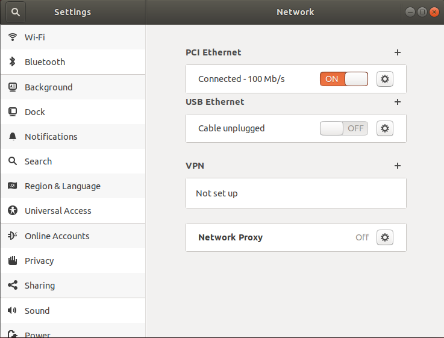

# Installing the Companion Computer Software Image

The operating system and supporting software is installed by writing a pre-configured `.img` file to an SD Card which is then inserted into the Companion Computer (Raspberry Pi). 

1. Insert a microSD card with at least 4GB capacity into your topside computer with a card reader.
2. Download the Companion image [here](https://s3.amazonaws.com/downloads.bluerobotics.com/Pi/stable/ardusub-raspbian.img.zip)
3. While the image downloads, download and install [Etcher](https://etcher.io/). Make sure you select the correct download for your Operating System!
4. Open Etcher, select the image file (no need to extract beforehand) and your SD card, click 'Flash' and wait for it to complete.

5. Eject the SD card, and insert it into the Raspberry Pi.

# Network Setup

The *Companion Computer* is assigned a static IP address of 192.168.2.2, and it expects the surface computer to have an IP address of 192.168.2.1. The network configuration on the surface computer needs to be set up before it can communicate with the ROV. Choose your operating system below to display the appropriate network setup instructions.

	

	<button type="button" onclick="{ document.getElementById('windowsDiv').style.display = 'block'; document.getElementById('macDiv').style.display = 'none'; document.getElementById('linuxDiv').style.display = 'none'; }">Windows</a>
	

	

	<button type="button" class="btn btn-primary" onclick="{ document.getElementById('macDiv').style.display = 'block'; document.getElementById('windowsDiv').style.display = 'none'; document.getElementById('linuxDiv').style.display = 'none'; }">Mac</a>
	

	

	<button type="button" class="btn btn-primary" onclick="{ document.getElementById('linuxDiv').style.display = 'block'; document.getElementById('macDiv').style.display = 'none'; document.getElementById('windowsDiv').style.display = 'none'; }">Linux</a>
	

	<h1 id="windows">Windows 10</h1>
	<ol>
	<li>
Go to <em>Control Panel</em> &gt; <em>Network and Sharing Center</em> and then choose &quot;Change adapter settings&quot;.

	
 

	</li>
	<li>
Right click on the Ethernet adapter, then choose <em>Properties</em>.

	
 

	</li>
	<li>
In the properties dialog, choose <em>Internet Protocol Version 4 (TCP/IPv4)</em>, then click <em>Properties</em>.

	
 

	</li>
	<li>
Select &quot;Use the following IP address&quot; And enter 192.168.2.1 for the IP address and 255.255.255.0 for the Subnet mask. Then select OK.

	
 

	</li>
	</ol>
	
<strong>Firewall</strong>

	<ol>
	<li>
Go to <em>Control Panel</em> &gt; <em>Windows Firewall</em> and then select &quot;Allow an app or feature through Windows Firewall&quot;.

	</li>
	<li>
Select &quot;Change Settings&quot; and then select &quot;Open source ground control app provided by QGroundControl dev team&quot; or &quot;QGroundControl&quot;.

	
 

	</li>
	</ol>

	<h1 id="mac">Mac</h1>
	<ol>
	<li>
Go to <em>System Preferences</em> &gt; <em>Network</em>

	</li>
	<li>
If your computer has an Ethernet port, select Ethernet from the options on the left side. If you had to get a USB to Ethernet adapter, plug it in now then select it.

	</li>
	<li>
Select the dropdown next to &quot;Configure IPv4&quot; and then select &quot;Manually&quot;

	</li>
	<li>
Enter 192.168.2.1 for the IP Address and 255.255.255.0 for the Subnet Mask and then select apply.

	
 

	</li>
	</ol>

	<h1 id="linux">Linux (Ubuntu 16.04)</h1>
	<ol>
	<li>
Click the Network Icon in the toolbar at the top of the screen, and click &quot;Edit Connections...&quot;

	
 

	</li>
	<li>
Click &quot;Add&quot;

	
 

	</li>
	<li>
Select &quot;Ethernet&quot; for the connection type and click &quot;Create...&quot;

	
 

	</li>
	<li>
From the &quot;Device MAC Address&quot; dropdown, select the ethernet interface you want to use. If you are using the built in ethernet card on your computer, there will be only one choice. If you are using a USB to Ethernet adapter, find out which interface corresponds to the adapter by looking at the options before and after plugging the adapter into the computer.

	
 

	</li>
	<li>
Click the &quot;IPv4 Settings&quot; tab, and from the &quot;Method&quot; dropdown menu, select &quot;Manual&quot;. Click &quot;Add&quot;, and enter 192.168.2.1 for the Address, 255.255.255.0 for the Netmask and 0.0.0.0 for the Gateway. Click &quot;Save...&quot; to complete the setup.

	
 

	</li>
	</ol>

	<h1 id="linux">Linux (Ubuntu 18.04)</h1>
	<ol>
	<li>
Click on the Wifi icon in the toolbar at the top of the screen. Ubuntu 18.04 saves the profiles of every connection you make. If the pi is connected to the computer via USB to Ethernet convertor, click on &quot;Ethernet Connecting&quot;/&quot;USB Ethernet Connecting.&quot; If the pi is connected to the computer directly via an Ethernet Cable, click on &quot;Wired Connecting&quot;/&quot;PCI Ethernet Connecting.&quot; From the drop-down menu, select &quot;Wired Settings&quot;

	
 

	
 

	</li>
	<li>
Click on the gear icon next to your connection type.

	
 

	</li>
	<li>
Go to the &quot;IPv4&quot; tab for the connection type. Select IPv4 Method as &quot;Manual&quot; and enter the address information as shown in the figure. Click &quot;Apply&quot; to complete the setup.

	
 

	
 

	</li>
	</ol>

# Software Update

Before proceeding, it is recommended to check for the latest updates for the Companion Computer.

To perform a companion software update:

1. Plug a *fully charged* battery into the vehicle and connect the tether to the topside computer.

2. Navigate to [192.168.2.2:2770/network](http://192.168.2.2:2770/network) in an internet browser (Chrome, Edge, Firefox, etc.) and ensure that the vehicle has access to a WiFi network. If a webpage is not found at this address, verify the network settings are correct. Troubleshooting steps can be found [here](/reference/troubleshooting.md).

3. Navigate to [192.168.2.2:2770/system](http://192.168.2.2:2770/system). Click the button that says 'Update Companion'. If you do not see this button, then the companion software is up to date.

4. The update process will take between 5 and 20 minutes depending on the Internet connection speed. Wait for the update process to complete.

5. When it completes, refresh the browser. The Companion version should be updated, and the update available message should no longer appear.

6. If the update fails (usually due to a loss of internet connectivity), a warning will appear that the vehicle will reboot and to leave the battery plugged in. At this point, once, it is safe to either power down the vehicle or attempt the update again.
